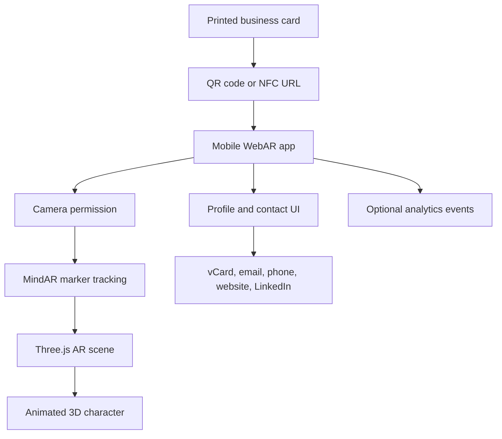

# AR Business Card System Design

## Vision

Create a physical business card with a printed visual marker. When someone scans a QR code or NFC tag on the card, a mobile web app opens, asks for camera access, recognizes the printed marker, and places an animated AR character on top of the card.

The experience is inspired by the ASUS ROG phone box AR sequence: the physical object becomes a stage, and the digital character appears to emerge into the real world.

## Product Flow

1. User receives the business card.
2. User scans the QR code or taps NFC.
3. The phone opens a secure web URL, for example `https://yourdomain.com/card/himesh`.
4. The web app asks for camera permission.
5. The user points the camera at the printed marker or card artwork.
6. The app recognizes the marker and anchors a 3D character to it.
7. The character plays an intro animation, then idles on the card.
8. The user can tap actions such as save contact, open website, email, LinkedIn, portfolio, or book a meeting.

## Recommended MVP Approach

Use WebAR first instead of a native app.

This avoids App Store friction and lets anyone scan the card from a normal phone camera. The physical card should include a QR code because browser-based AR cannot usually launch directly from recognizing a random shape in the native camera app. The QR code opens the web app, then the web app uses the camera to detect the printed marker.

## Recommended Tech Stack

- App framework: Vite + TypeScript
- UI framework: React
- AR tracking: MindAR image tracking
- 3D rendering: Three.js
- 3D model format: `.glb` / `.gltf`
- Animation: Three.js `AnimationMixer`, with optional GSAP for UI motion
- Hosting: Vercel, Netlify, Cloudflare Pages, or static S3
- Analytics later: Plausible, PostHog, or a small custom event API

## Why Marker-Based WebAR

For this use case, the card itself is a known printed object. Marker or image tracking is more reliable than trying to use general surface detection in the browser.

The marker can be:

- A designed symbol on the card
- A high-contrast logo-like shape
- A full card artwork region
- A hidden-in-plain-sight illustration that still looks good as print design

Avoid plain text, large blank spaces, glossy low-contrast graphics, and repeating patterns because tracking will suffer.

## High-Level Architecture



## Suggested Project Structure

```text
BusinessCard/
  package.json
  index.html
  vite.config.ts
  tsconfig.json
  public/
    manifest.webmanifest
    icons/
    vcard/
      himesh.vcf
  src/
    main.tsx
    app/
      App.tsx
      routes.ts
      config.ts
    ar/
      ARExperience.ts
      markerTracking.ts
      scene.ts
      characterController.ts
      interactions.ts
      trackingState.ts
    profile/
      profileData.ts
      ProfilePanel.tsx
      ContactActions.tsx
    ui/
      CameraPermissionView.tsx
      LoadingView.tsx
      UnsupportedDeviceView.tsx
      ErrorView.tsx
    assets/
      markers/
        source-card-image.png
        business-card.mind
      models/
        character.glb
      textures/
      audio/
    styles/
      global.css
  docs/
    card-print-guidelines.md
    asset-pipeline.md
    device-testing.md
```

## Core Modules

### `ARExperience`

Owns the lifecycle of the AR scene:

- Requests and starts camera access
- Initializes MindAR
- Connects tracking events to the scene
- Starts and stops the render loop
- Cleans up camera and WebGL resources

### `markerTracking`

Handles marker target setup:

- Loads the `.mind` target file
- Detects target found and target lost events
- Emits stable tracking state to the rest of the app

### `scene`

Creates the Three.js scene:

- Camera
- Lighting
- Renderer
- Anchor group
- Scaling rules for the card marker

### `characterController`

Owns character behavior:

- Loads the `.glb` model
- Plays intro animation
- Switches to idle animation
- Handles tap animations like wave, point, or reveal
- Pauses or fades the character when tracking is lost

### `profile`

Owns normal business-card UI:

- Name, role, company, tagline
- Save contact button
- Email, phone, website, LinkedIn, portfolio
- Optional meeting booking link

## MVP Feature Set

Build this first:

- Single card profile
- Single marker design
- Single animated character
- Browser camera permission screen
- Marker detection
- Character anchored to card
- Intro animation plus idle animation
- Tap character to trigger one extra animation
- Contact action buttons
- vCard download
- Mobile-first UI

Defer this:

- Admin dashboard
- User accounts
- Multiple card templates
- Native mobile app
- Real-time backend
- Complex cinematic sequences
- AI-generated custom characters

## Card Design Requirements

The printed card should include:

- QR code to open the WebAR URL
- The visual marker used for AR tracking
- A short fallback URL
- Normal readable contact details

The AR marker should be:

- High contrast
- Rich in unique visual features
- Matte printed if possible
- Large enough to fill a meaningful part of the camera view
- Stable across print batches

Good marker ideas:

- A geometric sigil behind the name
- A custom monogram
- A blueprint-style symbol
- A stylized portal, elevator outline, or stage platform
- A logo-like shape with internal detail

## Character Experience Ideas

Simple MVP:

- Character appears with a small portal or flash
- Character waves
- Character points at contact buttons
- Character idles on the card

More cinematic later:

- The marker becomes a platform
- A hatch, elevator, or doorway opens on the card
- Character rises up from below the card
- Character looks around, then introduces you
- Tapping contact buttons makes the character react

Business-focused variants:

- Tech founder: hologram assistant
- Designer: sketch character that turns 3D
- Consultant: tiny presenter with floating charts
- Developer: robot or avatar assembling UI panels
- Gaming brand: ROG-inspired character entrance

## Asset Pipeline

1. Design final card marker artwork.
2. Generate the MindAR target file from that image.
3. Create or source a 3D character.
4. Rig and animate in Blender or Mixamo.
5. Export as `.glb`.
6. Compress and optimize the model.
7. Test on real phones over HTTPS.

Recommended mobile budget:

- Character model: 2-5 MB
- Texture sizes: 1024px or lower where possible
- First load: under 5 seconds on a normal phone network
- Animations: short loops and short one-shot clips

## Backend Strategy

For MVP, no backend is required.

Use static JSON or TypeScript profile data:

```ts
export const profile = {
  slug: "himesh",
  name: "Himesh",
  title: "Founder / Developer",
  email: "hello@example.com",
  website: "https://example.com",
  linkedin: "https://linkedin.com/in/example"
};
```

Add a backend later only when needed for:

- Multiple users
- Editable profiles
- Analytics dashboards
- Uploaded models
- Dynamic card campaigns
- A/B testing card designs

## Main Risks

- iOS Safari camera behavior must be tested on real devices.
- HTTPS is required for camera access.
- Marker tracking can fail under glare, low light, blur, or weak artwork.
- Large 3D models can make the experience feel broken before it loads.
- WebAR browser support is less powerful than native ARKit or ARCore.
- NFC should be treated as optional because QR is more universal.

## Development Phases

### Phase 1: Prototype

- Create Vite app
- Add camera permission flow
- Add MindAR marker tracking
- Display a simple cube or placeholder model on the card
- Test on Android Chrome and iOS Safari

### Phase 2: MVP

- Add real card artwork
- Add real `.mind` marker target
- Add animated `.glb` character
- Add polished profile actions
- Add vCard download
- Deploy to HTTPS hosting

### Phase 3: Product

- Support multiple card slugs
- Add scan and click analytics
- Add profile configuration
- Add multiple character templates
- Add richer intro animations

### Phase 4: Premium Experience

- Custom character per person or brand
- Cinematic entrance sequence
- Voiceover or sound effects
- Native companion app if browser limitations become too restrictive
- Admin dashboard for business teams

## Recommended First Build Target

Start with this proof:

> Scan QR, open web app, point camera at printed marker, and show a placeholder 3D object locked to the card.

Once that works reliably on real phones, replace the placeholder object with the animated character and polish the card design.
